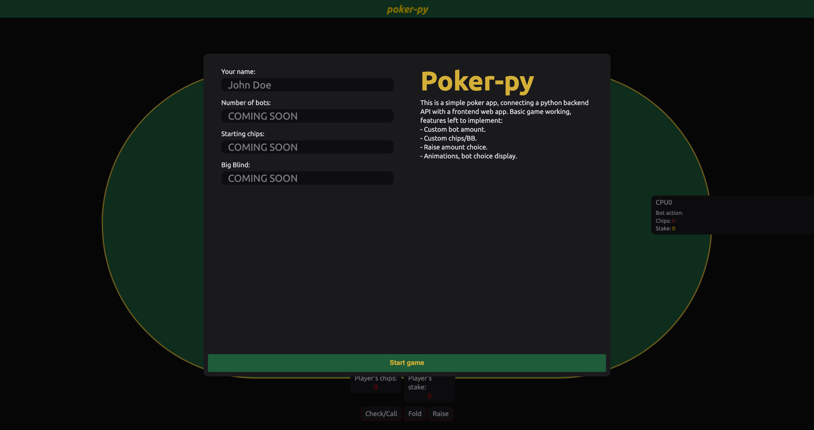
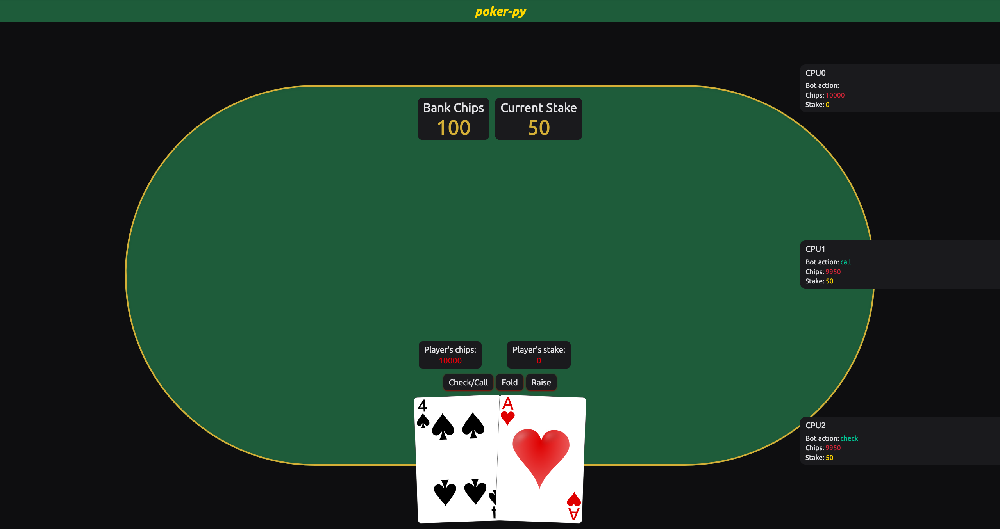
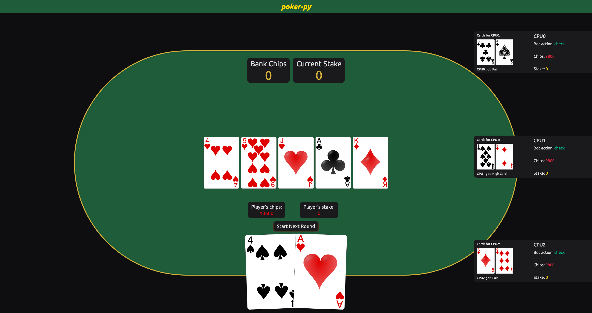

# Poker-py 🃏

A full-stack poker application built with Python Flask backend and React TypeScript frontend. Play Texas Hold'em poker against intelligent CPU opponents with real-time game state management.

## 🛠️ Built With


## 🎮 Features

- **Texas Hold'em Poker**: Complete implementation with all game phases (preflop, flop, turn, river, showdown)
- **Intelligent CPU Opponents**: Bots that make decisions based on hand strength and pot odds
- **Real-time Game State**: Live updates using Redux state management
- **Hand Evaluation**: Uses the `treys` library for accurate poker hand ranking
- **Game Statistics**: Track chips, stakes, and game progression

## 🏗️ Architecture

```
poker-py/
├── backend/                 # Flask API server
│   ├── app.py              # Main Flask application
│   ├── game_logic/         # Poker game engine
│   │   ├── game_controller.py  # Main game logic
│   │   ├── player.py       # Player and CPU classes
│   │   └── deck.py         # Card deck implementation
│   └── requirements.txt    # Python dependencies
├── frontend/               # React TypeScript app
│   ├── src/
│   │   ├── views/          # React components
│   │   ├── store/          # Redux state management
│   │   ├── types/          # TypeScript interfaces
│   │   └── utils/          # Utility functions
│   └── package.json        # Node.js dependencies
└── README.md               # This file
```

## 🚀 Quick Start (Development)

### Prerequisites

- Python 3.11+
- Node.js 18+
- npm or yarn

### Backend Setup

1. **Navigate to backend directory**

   ```bash
   cd backend
   ```

2. **Create virtual environment**

   ```bash
   python -m venv venv
   source venv/bin/activate  # On Windows: venv\Scripts\activate
   ```

3. **Install dependencies**

   ```bash
   pip install -r requirements.txt
   ```

4. **Run the Flask server**
   ```bash
   python app.py
   ```
   Backend will be available at http://localhost:5000

### Frontend Setup

1. **Navigate to frontend directory**

   ```bash
   cd frontend
   ```

2. **Install dependencies**

   ```bash
   npm install
   ```

3. **Start development server**
   ```bash
   npm run dev
   ```
   Frontend will be available at http://localhost:3000

## 🎯 How to Play

1. **Start a New Game**: Enter your name and click "Start Game"
2. **Game Actions**:
   - **Check/Call**: Match the current bet or check if no bet
   - **Fold**: Discard your hand and exit the round
   - **Raise**: Increase the bet (currently fixed at 100 chips)
3. **Game Phases**: The game progresses through preflop, flop, turn, river, and showdown
4. **Winning**: Best poker hand wins the pot

## 🤖 CPU Opponent Logic

The CPU players use intelligent decision-making based on:

- **Hand Strength**: Calculated using the treys evaluator
- **Pot Odds**: Betting decisions based on chip stack ratios
- **Game Phase**: Different strategies for preflop vs. post-flop play
- **Risk Management**: Conservative play with weak hands, aggressive with strong hands

## 🔧 API Endpoints

| Endpoint                     | Method | Description           |
| ---------------------------- | ------ | --------------------- |
| `/api/game`                  | POST   | Initialize a new game |
| `/api/game/{id}/start-round` | GET    | Start a new round     |
| `/api/game/{id}/action`      | POST   | Submit player action  |

### Example API Usage

```javascript
// Start a new game
const response = await axios.post("/api/game", {
  username: "Player1",
  custom_chips: 1000,
  cpu_num: 3,
  big_blind: 50,
});

// Make a player action
await axios.post(`/api/game/${gameId}/action`, {
  action: "call",
  amount: 50,
});
```

## 🖼️ Screenshots

### Game Setup



### Game UI



### Showdown



## 📋 Roadmap & Improvements

### High Priority

- [ ] **🐳 Docker Setup**: Create Dockerfiles and docker-compose.yml for easy deployment
- [ ] **🎨 UI Enhancement**: Improve visual design, add animations, better card graphics
- [ ] **🎮 Custom Raise Amounts**: Allow players to choose raise amounts instead of fixed 100

### Medium Priority

- [ ] **🤖 Better Bot Feedback**: Show what actions bots are taking
- [ ] **⚙️ Game Configuration**: Adjustable number of bots, starting chips, blind levels
- [ ] **🔊 Audio**: Sound effects for actions and game events
- [ ] **📱 Mobile Responsive**: Optimize for mobile devices

### Future Features

- [ ] **📊 Statistics**: Player performance tracking
- [ ] **🎯 AI Difficulty**: Adjustable bot intelligence levels
- [ ] **💾 Game State Persistence**: Save/load games

## 🛠️ Tech Stack

### Backend

- **Flask**: Web framework
- **treys**: Poker hand evaluation library
- **Flask-CORS**: Cross-origin resource sharing

### Frontend

- **React 19**: UI framework
- **TypeScript**: Type safety
- **Redux Toolkit**: State management
- **Tailwind CSS**: Styling
- **Axios**: HTTP client

### Development Tools

- **Vite**: Build tool
- **ESLint**: Code linting

## 🤝 Contributing

1. Fork the repository
2. Create a feature branch (`git checkout -b feature/amazing-feature`)
3. Commit your changes (`git commit -m 'Add amazing feature'`)
4. Push to the branch (`git push origin feature/amazing-feature`)
5. Open a Pull Request

## 🔍 Troubleshooting

### Common Issues

**Backend not starting:**

- Ensure Python 3.11+ is installed
- Activate virtual environment: `source venv/bin/activate`
- Install dependencies: `pip install -r requirements.txt`
- Verify port 5000 is available

**Frontend not connecting to backend:**

- Ensure backend is running on port 5000
- Check if both servers are running simultaneously
- Verify API endpoints are accessible at http://localhost:5000

---

**Ready to play some poker! 🃏🎉**
